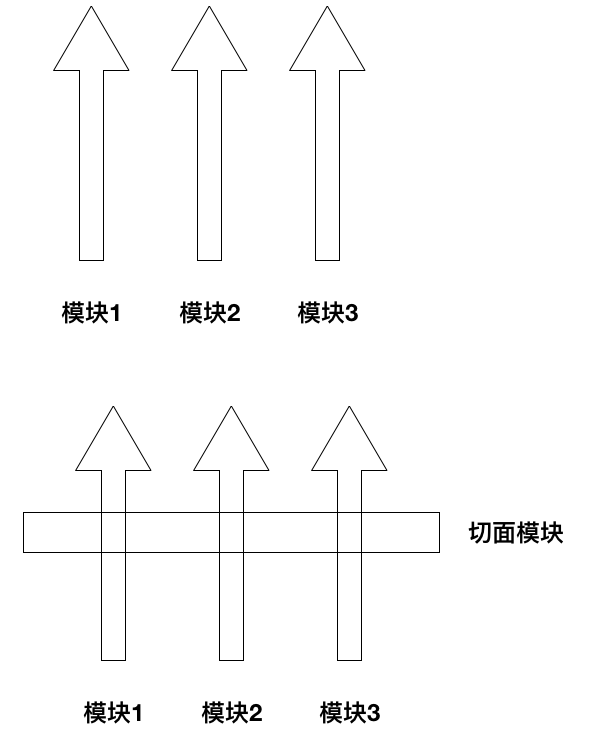

# Spring之aop切面编程的提出

# 一、需求:在程序执行期间特定步骤写入日志：

* 例如：记录用户请求路径，记录用户非法操作，记录数据库操作。如果每次操作，手动做日至记录很不方便，而且导致业务代码和技术代码混杂，不利于维护。由此产生了面向切面编程

      public class UserServiceImpl implements UserService {
          private static final Logger log = Logger.getLogger(UserServiceImpl.class); 
          public boolean addNewUser(User user) {
              log.info(“添加用户 ” + user.getUsername());//记录日志
              SqlSession sqlSession = null;
              boolean flag = false;
              //异常处理
              try {
                  sqlSession = MyBatisUtil.createSqlSession();
                  if (sqlSession.getMapper(UserMapper.class).add(user) > 0)
                      flag = true;
                  sqlSession.commit(); //事务控制
             } catch (Exception e) {
                  log.error("添加用户 " + user.getUsername() + "失败", e); //记录日志
                  sqlSession.rollback(); //事务控制
                  flag = false;
              } finally {
                  MyBatisUtil.closeSqlSession(sqlSession);
              }
              return flag;
          }
      }

* 实际编码包括两方面内容。**业务及辅助代码**。切面编程可以让我们专注于业务代码。

### 二、问题解决

* spring框架提出的aop很好的解决了这个问题。

* AOP(Aspect-Oriented Programming, 面向切面编程): 是一种新的方法论, 是对传统 OOP(Object-Oriented Programming, 面向对象编程) 的补充。

* AOP 的好处: 每个事物逻辑位于一个位置, 代码不分散, 便于维护和升级；业务模块更简洁, 只包含核心业务代码。

  

