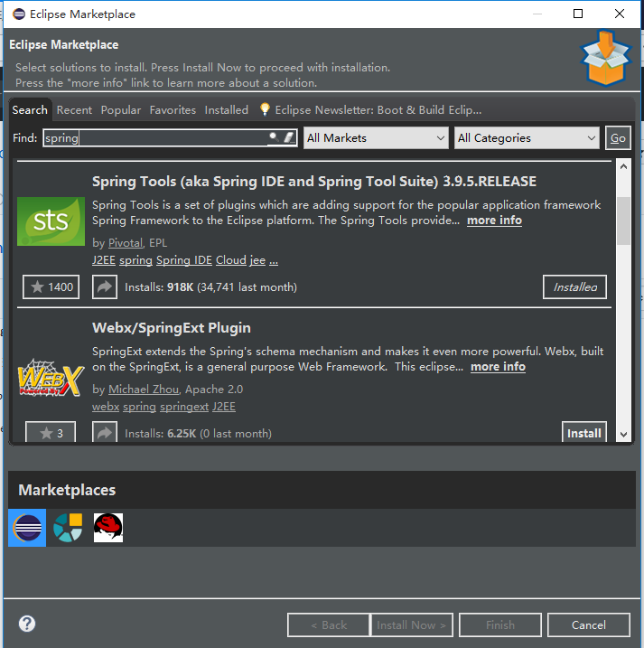

# Spring入门之eclipse

### 一、环境配置

* 1、安装spring开发插件
    
    * help->Eclipse Marketplace->搜索spring tools
    
      

* 2、导入jar包(spring需要beans,core,context,expression(Spel)4个基础包+日志实现(common-logging+log4j)附加包)

      <dependency>
          <groupId>org.springframework</groupId>
          <artifactId>spring-beans</artifactId>
          <version>4.3.14.RELEASE</version>
      </dependency>
      <dependency>
          <groupId>org.springframework</groupId>
          <artifactId>spring-core</artifactId>
          <version>4.3.14.RELEASE</version>
      </dependency>
      <dependency>
          <groupId>org.springframework</groupId>
          <artifactId>spring-context</artifactId>
          <version>4.3.14.RELEASE</version>
      </dependency>
      <dependency>
          <groupId>org.springframework</groupId>
          <artifactId>spring-expression</artifactId>
          <version>4.3.13.RELEASE</version>
      </dependency>
      <dependency>
          <groupId>commons-logging</groupId>
          <artifactId>commons-logging</artifactId>
          <version>1.2</version>
      </dependency>
      <dependency>
          <groupId>log4j</groupId>
          <artifactId>log4j</artifactId>
          <version>1.2.17</version>
      </dependency>

