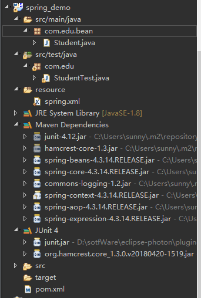

# Spring入门之eclipse

### 一、环境配置

* 1、安装spring开发插件
    
    * help->Eclipse Marketplace->搜索spring tools
    
      

* 2、导入jar包(spring需要beans,core,context,expression(Spel)4个基础包+日志实现(common-logging+log4j)附加包)

      <dependency>
          <groupId>org.springframework</groupId>
          <artifactId>spring-beans</artifactId>
          <version>4.3.14.RELEASE</version>
      </dependency>
      <dependency>
          <groupId>org.springframework</groupId>
          <artifactId>spring-core</artifactId>
          <version>4.3.14.RELEASE</version>
      </dependency>
      <dependency>
          <groupId>org.springframework</groupId>
          <artifactId>spring-context</artifactId>
          <version>4.3.14.RELEASE</version>
      </dependency>
      <dependency>
          <groupId>org.springframework</groupId>
          <artifactId>spring-expression</artifactId>
          <version>4.3.13.RELEASE</version>
      </dependency>
      <dependency>
          <groupId>commons-logging</groupId>
          <artifactId>commons-logging</artifactId>
          <version>1.2</version>
      </dependency>
      <dependency>
          <groupId>log4j</groupId>
          <artifactId>log4j</artifactId>
          <version>1.2.17</version>
      </dependency>

     

* 3、Hello World
        
     * 新建bean --Student
     
            package com.edu.bean;

            public class Student {
                private String name;
                private String gender;

                public String getName() {
                    return name;
                }

                public void setName(String name) {
                    this.name = name;
                }

                public String getGender() {
                    return gender;
                }

                public void setGender(String gender) {
                    this.gender = gender;
                }

                @Override
                public String toString() {
                    return "Student [name=" + name + ", gender=" + gender + "]";
                }
            }     

     * 之前创建对象的传统方式
     
            public class StudentTest {
                @Test
                public void test1() {
                    Student student = new Student();
                    student.setName("小明");
                    student.setGender("男");
                    System.out.println(student);
                }
            }

* 4、spring使用方式：

    * 在resource资源文件夹下新建 ->other ->spring

         

    * 起名spring.xml
    
            <?xml version="1.0" encoding="UTF-8"?>
            <beans xmlns="http://www.springframework.org/schema/beans"
                xmlns:xsi="http://www.w3.org/2001/XMLSchema-instance"
                xsi:schemaLocation="http://www.springframework.org/schema/beans 
                                  http://www.springframework.org/schema/beans/spring-beans.xsd">

                <!-- 配置bean -->
                <bean id="student" class="com.edu.bean.Student">
                    <property name="name" value="小红"></property>
                    <property name="gender" value="女"></property>
                </bean>
            </beans>
    
### 二、测试

    package com.edu;

    import org.junit.Test;
    import org.springframework.context.ApplicationContext;
    import org.springframework.context.support.ClassPathXmlApplicationContext;

    import com.edu.bean.Student;

    public class StudentTest {
        @Test
        public void testSpringBean() {
            //1.创建ioc容器对象：
            ApplicationContext applicationContext = new ClassPathXmlApplicationContext("spring.xml");
            //2.从容器中获得维护的Student实例

            //通过id
            Student student1 = (Student)applicationContext.getBean("student");
            //通过类名
            Student student2 = applicationContext.getBean(Student.class);

            System.out.println(student1);
            System.out.println(student2);
        }
    }

