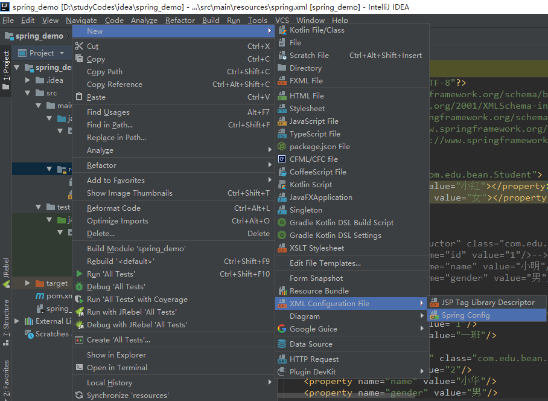

# Spring入门之idea

### 一、导入jar包

>spring需要beans,core,context,expression(Spel)4个基础包+日志实现(common-logging+log4j)附加包

    <dependency>
        <groupId>org.springframework</groupId>
        <artifactId>spring-beans</artifactId>
        <version>4.3.14.RELEASE</version>
    </dependency>
    <dependency>
        <groupId>org.springframework</groupId>
        <artifactId>spring-core</artifactId>
        <version>4.3.14.RELEASE</version>
    </dependency>
    <dependency>
        <groupId>org.springframework</groupId>
        <artifactId>spring-context</artifactId>
        <version>4.3.14.RELEASE</version>
    </dependency>
    <dependency>
        <groupId>org.springframework</groupId>
        <artifactId>spring-expression</artifactId>
        <version>4.3.13.RELEASE</version>
    </dependency>
    <dependency>
        <groupId>commons-logging</groupId>
        <artifactId>commons-logging</artifactId>
        <version>1.2</version>
    </dependency>
    <dependency>
        <groupId>log4j</groupId>
        <artifactId>log4j</artifactId>
        <version>1.2.17</version>
    </dependency>

### 二、新建spring的xml文件

* 1、在resource资源文件夹下新建XML Configuration File->Spring Config

     

* 2、取名spring.xml

      <?xml version="1.0" encoding="UTF-8"?>
      <beans xmlns="http://www.springframework.org/schema/beans"
          xmlns:xsi="http://www.w3.org/2001/XMLSchema-instance"
          xsi:schemaLocation="http://www.springframework.org/schema/beans 
                http://www.springframework.org/schema/beans/spring-beans.xsd">

      </beans>

### 三、应用

* 1、新建bean --Student 

       package com.edu.bean;

       public class Student {
           private String name;
           private String gender;

           public String getName() {
               return name;
           }

           public void setName(String name) {
               this.name = name;
           }

           public String getGender() {
               return gender;
           }

           public void setGender(String gender) {
               this.gender = gender;
           }

           @Override
           public String toString() {
               return "Student [name=" + name + ", gender=" + gender + "]";
           }
       }     

* 2、在spring.xml文件中添加配置

      <!-- 配置bean -->
      <bean id="student" class="com.weixin.bean.Student">
          <property name="name" value="小红"></property>
          <property name="gender" value="女"></property>
      </bean>

* 3、测试

      package com.edu;

      import org.junit.Test;
      import org.springframework.context.ApplicationContext;
      import org.springframework.context.support.ClassPathXmlApplicationContext;

      import com.edu.bean.Student;

      public class StudentTest {
          @Test
          public void testSpringBean() {
              //1.创建ioc容器对象：
              ApplicationContext applicationContext = new ClassPathXmlApplicationContext("spring.xml");
              //2.从容器中获得维护的Student实例

              //通过id
              Student student1 = (Student)applicationContext.getBean("student");
              //通过类名
              Student student2 = applicationContext.getBean(Student.class);

              System.out.println(student1);
              System.out.println(student2);
          }
      }

