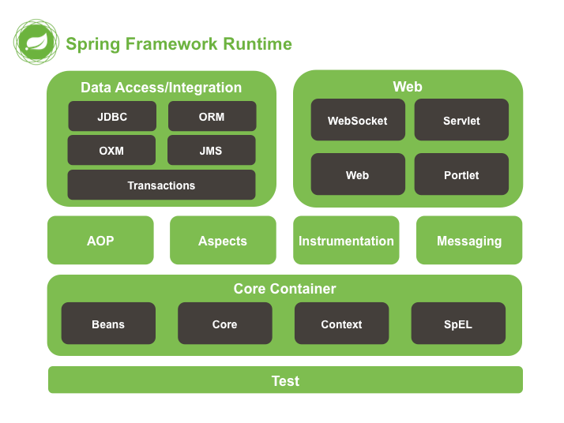

#  Spring概述之体系结构

### 一、Spring 教程

* Spring 框架是一个开源的 Java 平台，它为容易而快速的开发出耐用的 Java 应用程序提供了全面的基础设施。

* Spring 框架最初是由 Rod Johnson 编写的，并且 2003 年 6 月首次在 Apache 2.0 许可下发布。

### 二、内容：
   
   * 依赖注入：IOC容器
   
   * 面向切面编程：OP实现
   
   * 数据访问支持
       
       * 简化JDBC/ORM
       
       * 声明式事务
   
   * WEB集成

### 三、Spring体系结构:

* Spring一共有十几个组件，但是真正的核心组件只有几个

* 重要的几个模块：

    * core :核心，DI(IOC)
    * aop :面向切面编程
    * web: SpringMVC
