# 用idea建web工程

### 一、建工程

* File->New Project->Maven->Create from archetype->maven-archetype-webapp

    
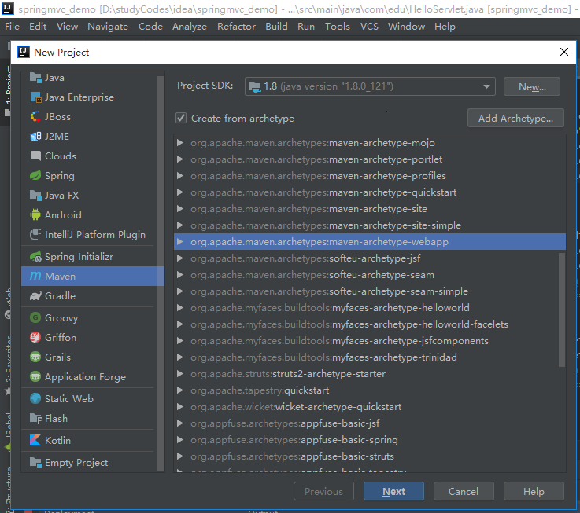

* Next->填写内容

    

* Next

    
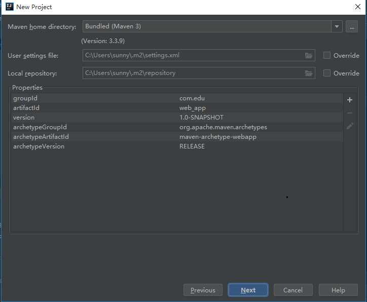

* Next

    
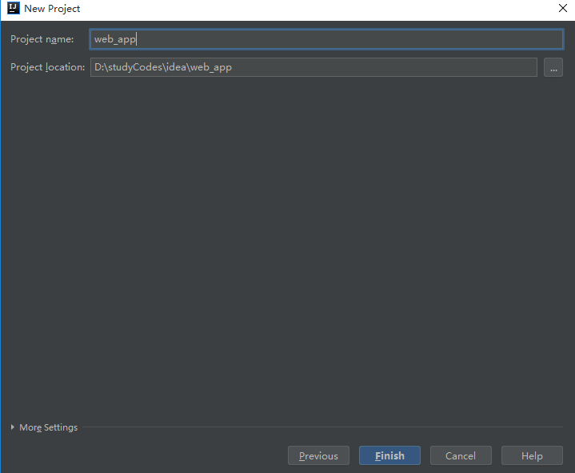

* Finish

    
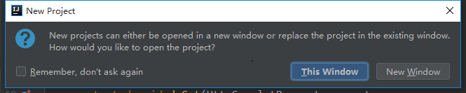

* 选择打开方式->删除build标签中的内容

    
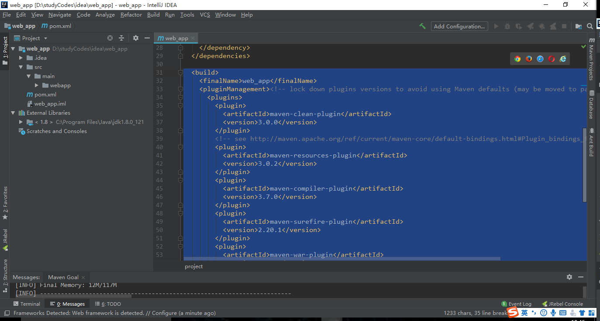

* 在main下新建java和resources文件夹、在src下新建test文件夹、再在test下建java文件夹

    
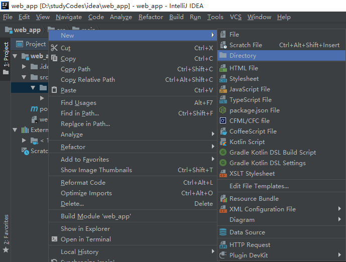

* 在main下建java文件夹
    
    
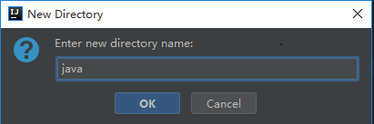

* 在main下建resources文件夹

    
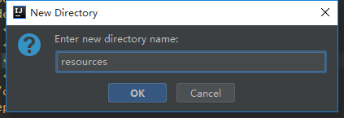

    
*  在src下新建test文件夹、再在test下建java文件夹

    
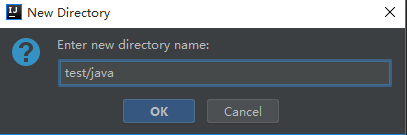

* web_app

    
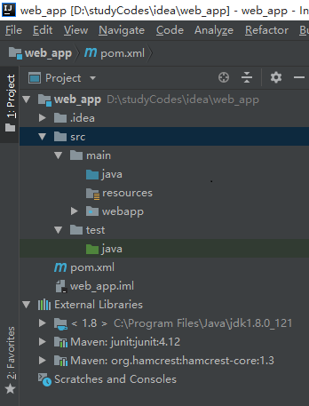

    
### 二、配置tomcat    
    
* Run/Debug Configurations

     
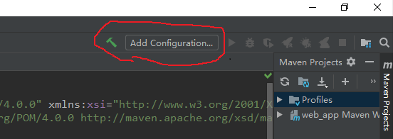

    
* 点击Templates
    
     
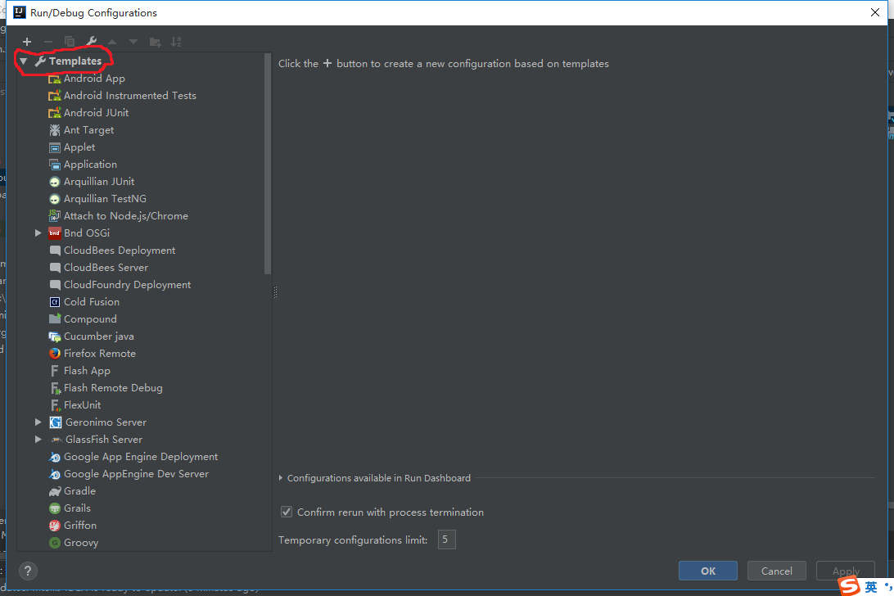

    
* 选择模板
    
     
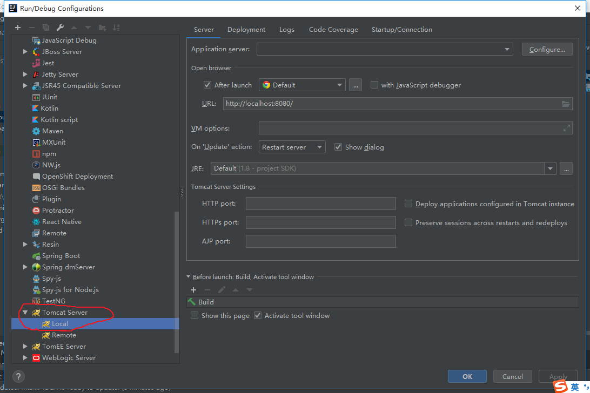

    
* 设置Deployment
     
     
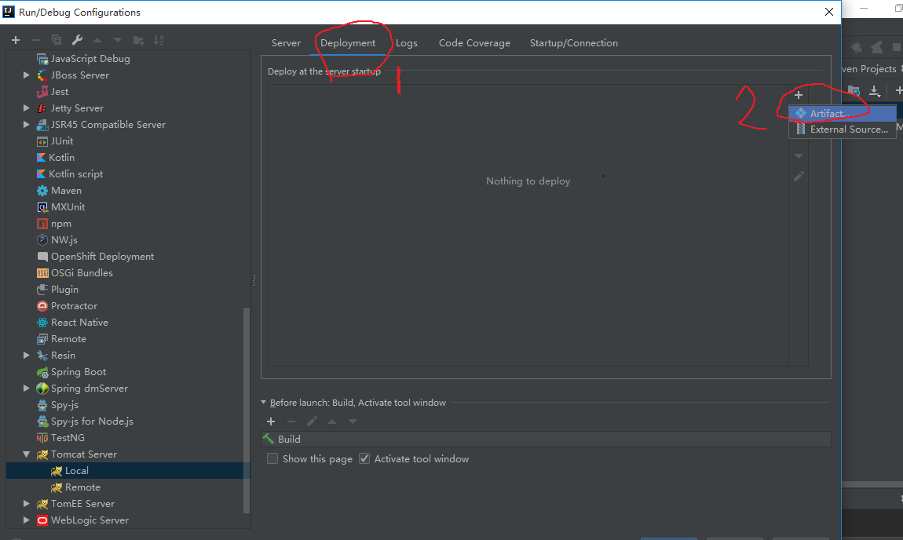

    
* 选择web样式
     
     
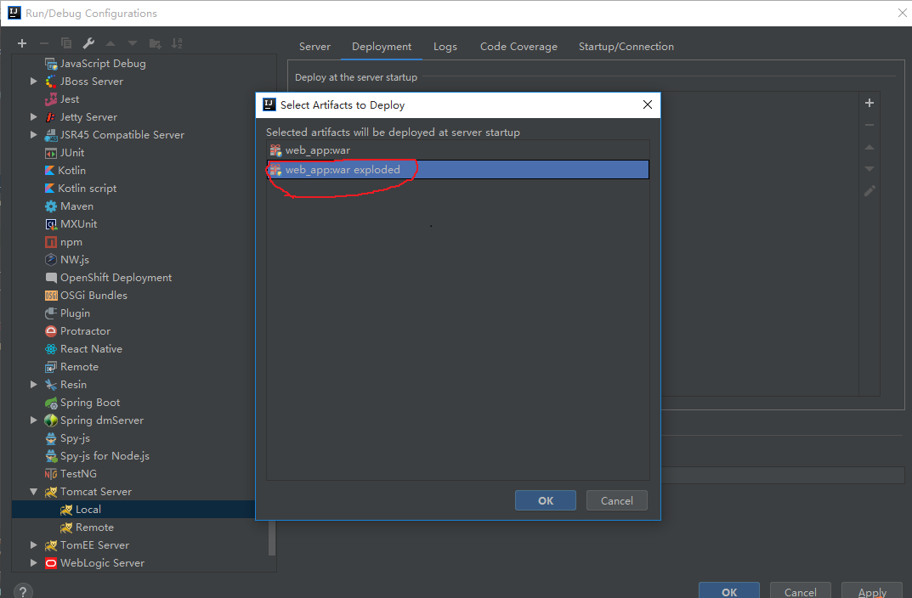

    
* 修改查看路径

     
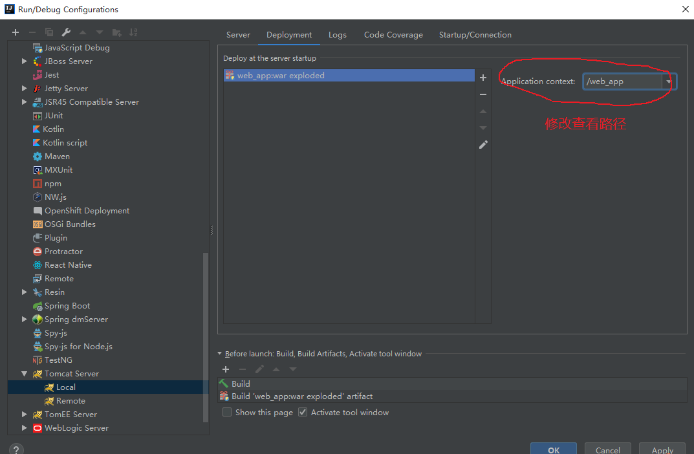

    
* 添加tomcat模板到项目
    
     
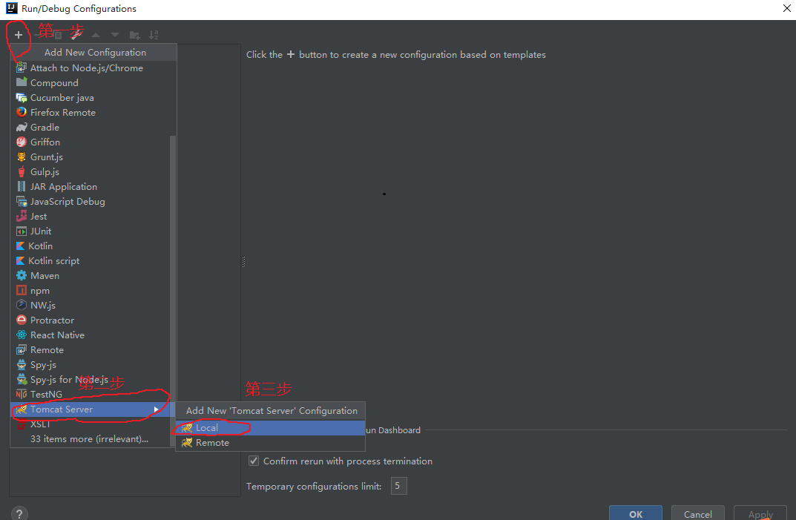

    
* 修改web版本
    
     
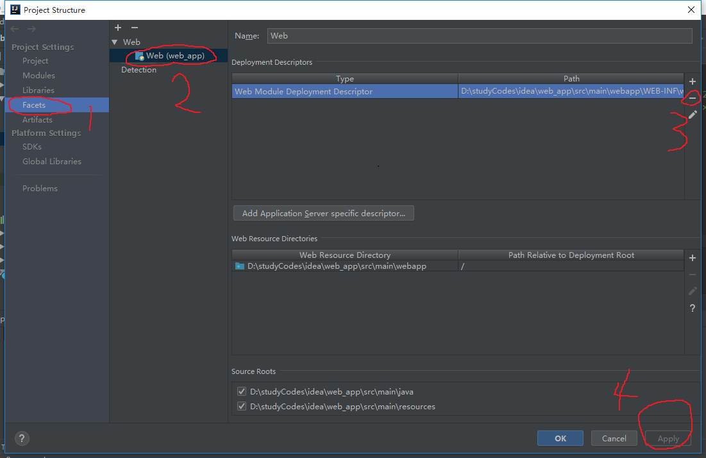

    
* 将web版本改为3.1
     
     
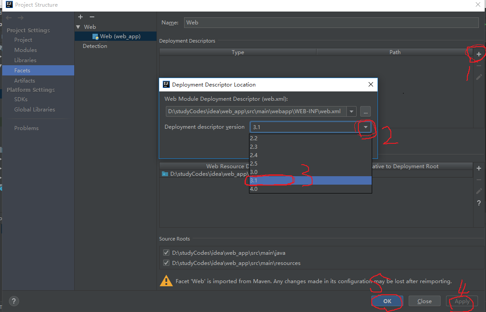

    
* 在浏览器输入http://localhost:8080/web_app/
     
     
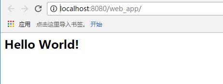
    
    
    
### 三、普通项目

* 导入servletjar包

        <dependency>
          <groupId>javax.servlet</groupId>
          <artifactId>javax.servlet-api</artifactId>
          <version>3.1.0</version>
          <scope>provided</scope>
        </dependency>

* HelloServlet

        package com.edu;

        import javax.servlet.ServletException;
        import javax.servlet.annotation.WebServlet;
        import javax.servlet.http.HttpServlet;
        import javax.servlet.http.HttpServletRequest;
        import javax.servlet.http.HttpServletResponse;
        import java.io.IOException;

        @WebServlet("/Hello")
        public class HelloServlet extends HttpServlet {
            protected void doPost(HttpServletRequest request,
                                  HttpServletResponse response)
                    throws ServletException, IOException {
                System.out.println("================");
            }

            protected void doGet(HttpServletRequest request,
                                 HttpServletResponse response)
                    throws ServletException, IOException {
                System.out.println("================");
            }
        }

    
* 在浏览器输入http://localhost:8080/springmvc_demo/Hello    
    
    
    
    
    
    
    
    
    
    
    
    
    
    
    
    
    
    
    
    
    
    
    
    
    
    
    
    
    
    
    
    
    
    
    
    
    
