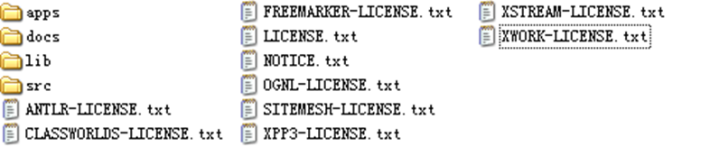

# Struts2_入门

### 一、Struts2简介

* 1、Struts2 是一个MVC框架，以WebWork框架的设计思想为核心，吸收了Struts1 的部分优点。

* 2、Struts2 拥有更加广阔的前景，自身功能强大，还对其他框架下开发的程序提供很好的兼容性。

    

* 3、[Struts官方地址](http://struts.apache.org)

* 4、Struts2 `Struts 2.3.15.1`目录结构

    

     * apps目录：Struts2示例应用程序
     * docs目录：Struts2指南、向导、API文档
     * lib目录：Struts 2的发行包及其依赖包
     * src目录：Struts 2项目源代码

### 二、Struts2使用说明

* 使用Struts 2 开发程序的基本步骤

    * 1、加载Struts2 类库     [下载](./struts2-lib-xml)

    * 2、配置web.xml文件

    * 3、开发视图层页面

    * 4、开发控制层Action（创建一个`xxxAction`继承自`com.opensymphony.xwork2.Action`并实现`execute()`方法）

    * 5、配置struts.xml文件

    * 6、部署、运行项目

* 1、Struts2 类库介绍

    <table>
       <tr>
          <td>文件名</td>
          <td>说   明</td>
       </tr>
       <tr>
          <td>struts2-core-xxx.jar</td>
          <td>Struts 2框架的核心类库</td>
       </tr>
       <tr>
          <td>xwork-core-xxx.jar</td>
          <td>XWork类库，Struts 2的构建基础</td>
       </tr>
       <tr>
          <td>ognl-xxx.jar</td>
          <td>Struts 2使用的一种表达式语言类库</td>
       </tr>
       <tr>
          <td>freemarker-xxx.jar</td>
          <td>Struts 2的标签模板使用类库</td>
       </tr>
       <tr>
          <td>javassist-xxx.GA.jar</td>
          <td>对字节码进行处理</td>
       </tr>
       <tr>
          <td>commons-fileupload-xxx.jar</td>
          <td>文件上传时需要使用</td>
       </tr>
       <tr>
          <td>commons-io-xxx.jar</td>
          <td>Java IO扩展</td>
       </tr>
       <tr>
          <td>commons-lang-xxx.jar</td>
          <td>包含了一些数据类型的工具类</td>
       </tr>
    </table>

* 2、配置 `web.xml`

        <filter>
            <filter-name>struts2</filter-name>
            <filter-class>
                org.apache.struts2.dispatcher.ng.filter.StrutsPrepareAndExecuteFilter
            </filter-class>
        </filter>
        <filter-mapping>
            <filter-name>struts2</filter-name>
            <url-pattern>/*</url-pattern>
        </filter-mapping>

* 3、配置struts.xml文件（redirect 重定向）

    >eg:

        <?xml version="1.0" encoding="UTF-8" ?>
        <!DOCTYPE struts PUBLIC
            "-//Apache Software Foundation//DTD Struts Configuration 2.0//EN"
            "http://struts.apache.org/dtds/struts-2.0.dtd">
        <struts>
            <!-- 创建一个default包，继承自Struts2的struts-default包 -->
            <package name="default" namespace="/" extends="struts-default">
                <!-- 接收处理用户的/hello.action请求 ， 并根据返回结果，完成跳转 -->
                <action name="hello" class="com.edu.acction.HelloAction">
                    <!-- 结果为"sucess"时，跳转至hello.jsp页面 -->
                    <result name="success" type="redirect">/hello.jsp</result><!--默认是转发，可以指定重定向-->
                    <result name="success">/hello.jsp</result><!-- 默认是转发 -->
                </action>
            </package>
        </struts>

### 三、初体验

* 1、加载Struts2 类库     [下载](./struts2-lib-xml)

* 2、配置web.xml文件

* 3、开发视图层页面

* 4、开发控制层Action

    * 创建一个`xxxAction`继承自`com.opensymphony.xwork2.Action`并实现`execute()`方法

            package com.edu.acction;

            import com.opensymphony.xwork2.Action;

            public class HelloAction implements Action{
                @Override
                public String execute() throws Exception {
                    System.out.println("Hello world!");
                    return "success";
                }
            }

* 5、配置struts.xml文件

        <?xml version="1.0" encoding="UTF-8" ?>
        <!DOCTYPE struts PUBLIC
            "-//Apache Software Foundation//DTD Struts Configuration 2.0//EN"
            "http://struts.apache.org/dtds/struts-2.0.dtd">
        <struts>
            <!-- 创建一个default包，继承自Struts2的struts-default包 -->
            <package name="default" namespace="/" extends="struts-default">
                <!-- 接收处理用户的/hello.action请求 ， 并根据返回结果，完成跳转 -->
                <action name="hello" class="com.edu.acction.HelloAction">
                    <!-- 结果为"sucess"时，跳转至hello.jsp页面 -->
                    <result name="success">/hello.jsp</result>
                </action>
            </package>
        </struts>

### 四、登录demo

* 1、加载Struts2 类库     [下载](./struts2-lib-xml)

* 2、配置web.xml文件

* 3、开发视图层页面（login.jsp）

        <%@ page language="java" contentType="text/html; charset=UTF-8"
            pageEncoding="UTF-8"%>
        <!DOCTYPE html>
        <html>
        <head>
        <meta charset="UTF-8">
        <title>登录页面</title>
        </head>
        <body>
            requestScope--${requestScope.error}
             
            sessionScope--${sessionScope.error1}
            <form action="${pageContext.request.contextPath}/login" method="post">
                <input type="text" name="username"/>
                <input type="text" name="password"/>
                <input type="submit" value="提交"/>
            </form>
        </body>
        </html>

* 4、开发控制层Action

        package com.edu.acction;

        import java.util.Map;

        import com.opensymphony.xwork2.Action;
        import com.opensymphony.xwork2.ActionContext;

        public class LoginAction implements Action{
            private String username;
            private String password;
            public String getUsername() {
                return username;
            }
            public void setUsername(String username) {
                this.username = username;
            }
            public String getPassword() {
                return password;
            }
            public void setPassword(String password) {
                this.password = password;
            }
            @Override
            public String execute() throws Exception {
                System.out.println(username + "----------" + password);
                if("小明".equals(username) && "123".equals(password)) {
                    return "success";
                }else {
                    //request域
                    Map<String, Object> requestMap = (Map<String, Object>)ActionContext.getContext().get("request");
                    requestMap.put("error", "error");
                    //sessio域
                    Map<String, Object> sessionMap = ActionContext.getContext().getSession();
                    sessionMap.put("error1", "error1");
                    return "error";
                }
            }
        }

* 5、配置struts.xml文件

        <?xml version="1.0" encoding="UTF-8" ?>
        <!DOCTYPE struts PUBLIC
            "-//Apache Software Foundation//DTD Struts Configuration 2.0//EN"
            "http://struts.apache.org/dtds/struts-2.0.dtd">
        <struts>
            <!-- 创建一个default包，继承自Struts2的struts-default包 -->
            <package name="default" namespace="/" extends="struts-default">

                <action name="login" class="com.edu.acction.LoginAction">
                    <!-- 结果为"sucess"时，跳转（重定向）至hello.jsp页面 -->
                    <result name="success" type="redirect">/hello.jsp</result><!-- 默认是转发,可以指定重定向 -->
                    <!-- 结果为"error"时，跳转（转发）至login.jsp页面 -->
                    <result name="error">/login.jsp</result>
                </action>
            </package>
        </struts>

### 五、Struts2 使用自定义方法

* 1、加载Struts2 类库     [下载](./struts2-lib-xml)

* 2、配置web.xml文件

* 3、开发视图层页面

* 4、开发控制层Action

        package com.edu.acction;

        public class StudentAction {
            public String add() {
                System.out.println("学生增加！");
                return "success";
            }

            public String delete() {
                System.out.println("学生删除！");
                return "success";
            }
        }

* 5、配置struts.xml文件

        <?xml version="1.0" encoding="UTF-8" ?>
        <!DOCTYPE struts PUBLIC
            "-//Apache Software Foundation//DTD Struts Configuration 2.0//EN"
            "http://struts.apache.org/dtds/struts-2.0.dtd">
        <struts>
            <!-- 创建一个default包，继承自Struts2的struts-default包 -->
            <package name="default" namespace="/" extends="struts-default">
                <action name="add" class="com.edu.acction.StudentAction" method="add">
                    <!-- 结果为"sucess"时，跳转至hello.jsp页面 -->
                    <result name="success">/hello.jsp</result>
                </action>
                <action name="delete" class="com.edu.acction.StudentAction" method="delete">
                    <!-- 结果为"sucess"时，跳转至hello.jsp页面 -->
                    <result name="success">/hello.jsp</result>
                </action>
            </package>
        </struts>

### 六、如何使用request,session保存信息？

* `request`:

        (Map) ActionContext.getContext().get("request");

* `session`:

        ActionContext.getContext().getSession()

### 七、Struts2 开发小结

* 开发Struts 2应用的基本环节

    * 确认环境
        
        * 是否添加了Struts 2框架支持文件
        
        * 是否配置了Filter
    
    * 功能实现
        
        * 编写Action类
    
    * 配置struts.xml文件
    
    * 编写视图
