# hibernate_环境搭建

>user表

    -- ----------------------------
    -- Table structure for user
    -- ----------------------------
    CREATE TABLE `user` (
      `id` int(11) NOT NULL auto_increment,
      `user_name` varchar(255) default NULL,
      `gender` char(1) default NULL,
      `email` varchar(255) default NULL,
      `c_id` int(11) default NULL,
      `birthday` date default NULL,
      PRIMARY KEY  (`id`)
    ) ENGINE=InnoDB AUTO_INCREMENT=113 DEFAULT CHARSET=utf8;

* 1、在eclipse的`help->Eclipse Marketplace`下载安装hibernate插件（安装时仅选带hibernate的就行<只有一个>）

    
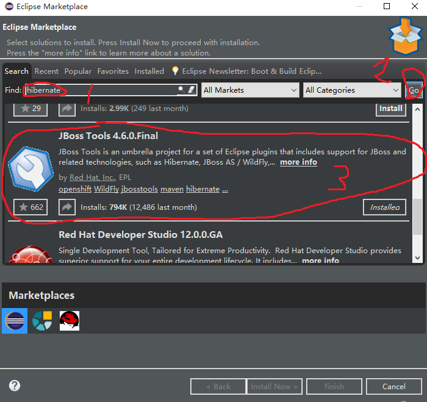

* 2、建一个`Java Project`项目（添加项目名后直接Finish即可）

    
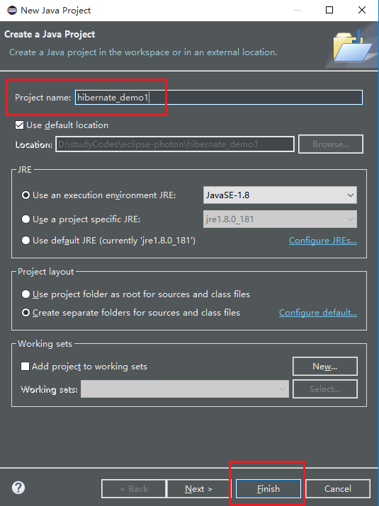

    
* 3、创建lib文件夹放置jar包

    
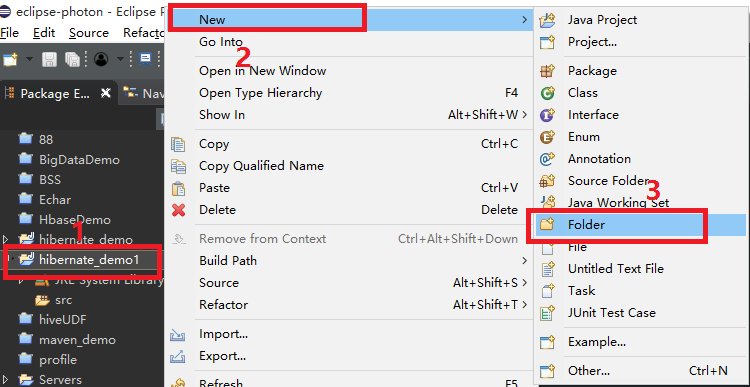

* 4、导入jar包 [jar包下载](./hibernate-lib)

    
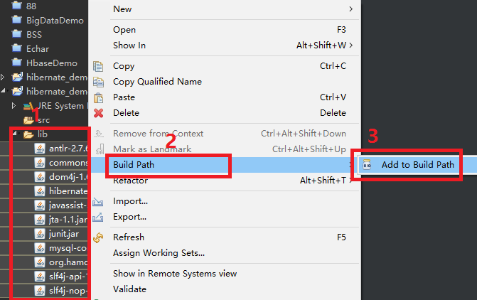

* 5、建hibernate的配置文件`点击项目的src右键->new->Other->Hibernate`

    
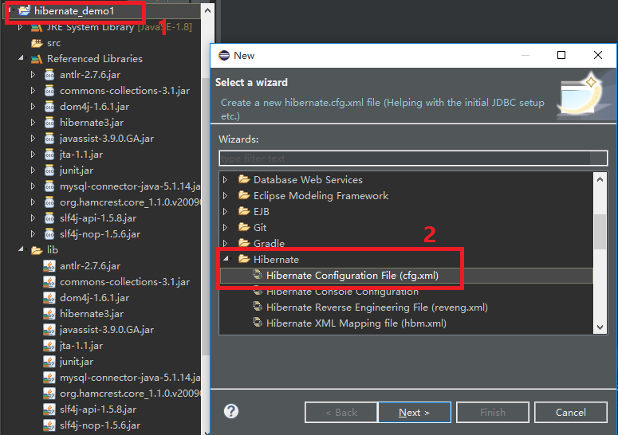

* 6、选择项目，为配置文件命名

    
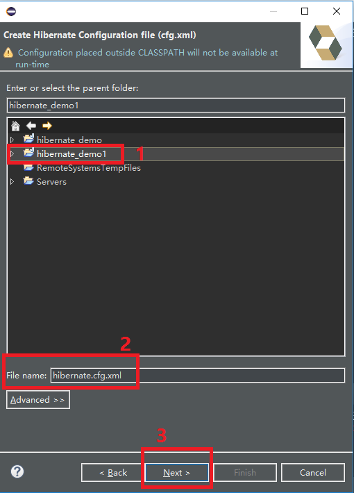

* 7、填写默认生成的信息

    * Hibernate version：5.2及以下
    
    * Session factory name：sessionFactory（随便填）
    
    * Database dialect:`MySQL5`
    
    * Dirver class:`com.mysql.jdbc.Driver`
    
        
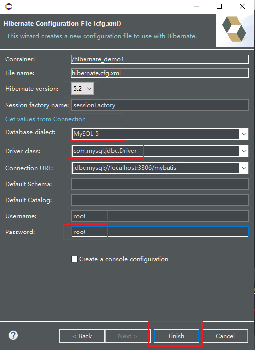
 

* 8、建一个实体类（User）

    
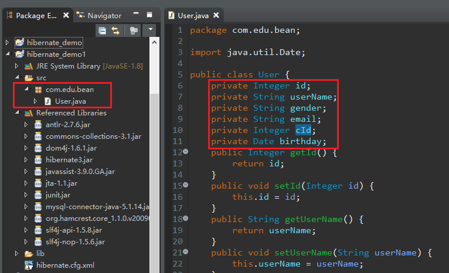

* 9、创建User的映射文件`点击User类文件右键->new->Other->Hibernate->hmb.xml`

    
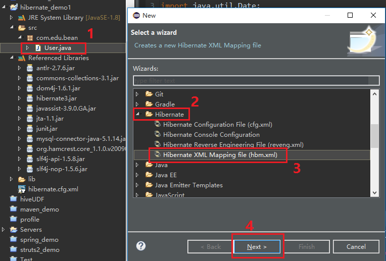

* 10、修改`User.hbm.xml`的`column`字段和数据库匹配（还有id的`<generator class="identity" />`）

    
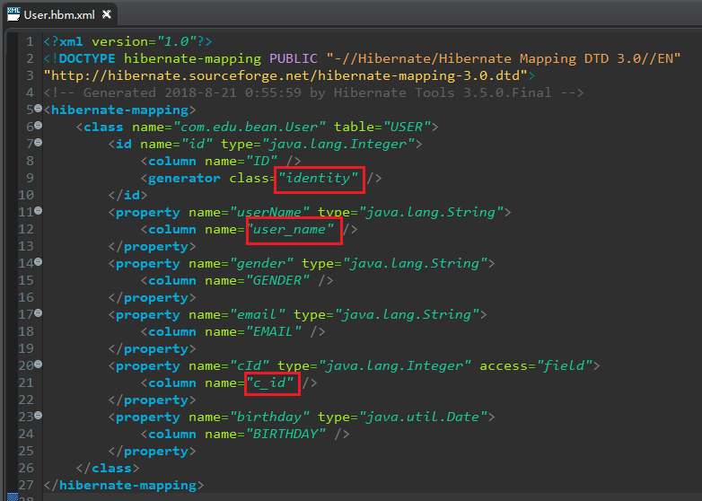

        <?xml version="1.0"?>
        <!DOCTYPE hibernate-mapping PUBLIC "-//Hibernate/Hibernate Mapping DTD 3.0//EN"
        "http://hibernate.sourceforge.net/hibernate-mapping-3.0.dtd">
        <!-- Generated 2018-8-21 0:55:59 by Hibernate Tools 3.5.0.Final -->
        <hibernate-mapping>
            <class name="com.edu.bean.User" table="USER">
                <id name="id" type="java.lang.Integer">
                    <column name="ID" />
                    <generator class="identity" />
                </id>
                <property name="userName" type="java.lang.String">
                    <column name="user_name" />
                </property>
                <property name="gender" type="java.lang.String">
                    <column name="GENDER" />
                </property>
                <property name="email" type="java.lang.String">
                    <column name="EMAIL" />
                </property>
                <property name="cId" type="java.lang.Integer" access="field">
                    <column name="c_id" />
                </property>
                <property name="birthday" type="java.util.Date">
                    <column name="BIRTHDAY" />
                </property>
            </class>
        </hibernate-mapping>

* 11、把映射文件加到总配置文件里`<mapping resource="com/edu/bean/User.hbm.xml"/>`

    
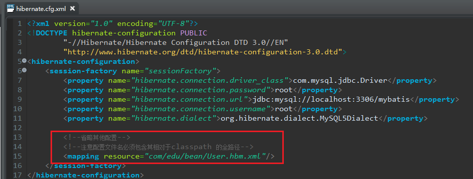

* 12、建test类测试项目

    
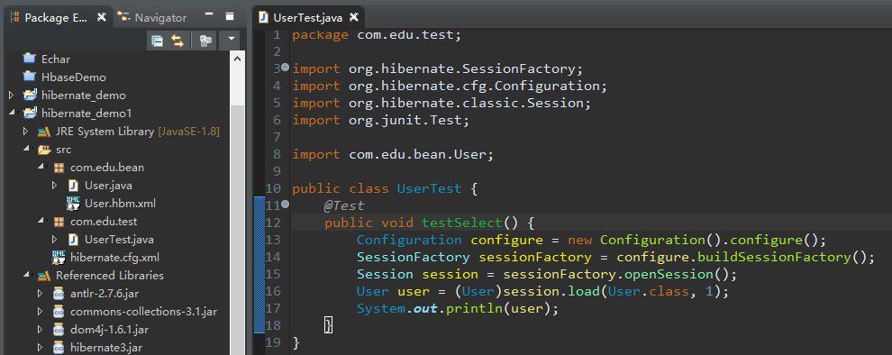

        package com.edu.test;

        import org.hibernate.SessionFactory;
        import org.hibernate.cfg.Configuration;
        import org.hibernate.classic.Session;
        import org.junit.Test;

        import com.edu.bean.User;

        public class UserTest {
            @Test
            public void testSelect() {
                Configuration configure = new Configuration().configure();
                SessionFactory sessionFactory = configure.buildSessionFactory();
                Session session = sessionFactory.openSession();
                User user = (User)session.load(User.class, 1);
                System.out.println(user);
            }
        }

* 13、常见BUG

    * 没将总配置文件放在类类路径下

        
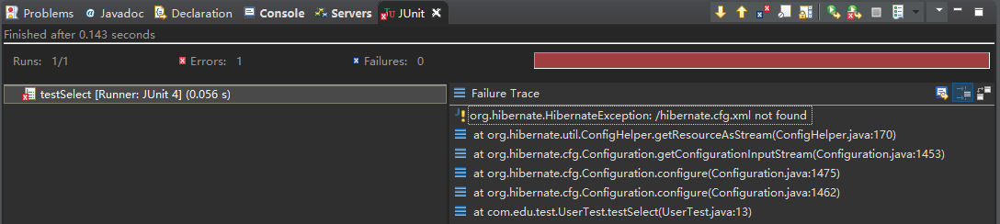

        * 问题处理：

            
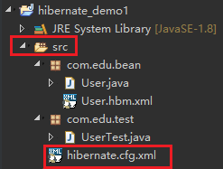

    * 总配置文件加载出错，将源修改为`http://hibernate.sourceforge.net/hibernate-configuration-3.0.dtd`

        
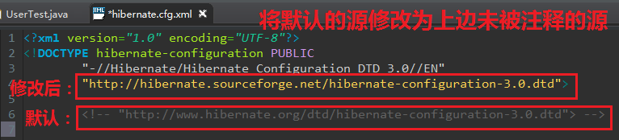

