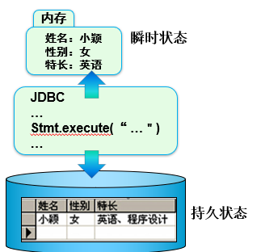
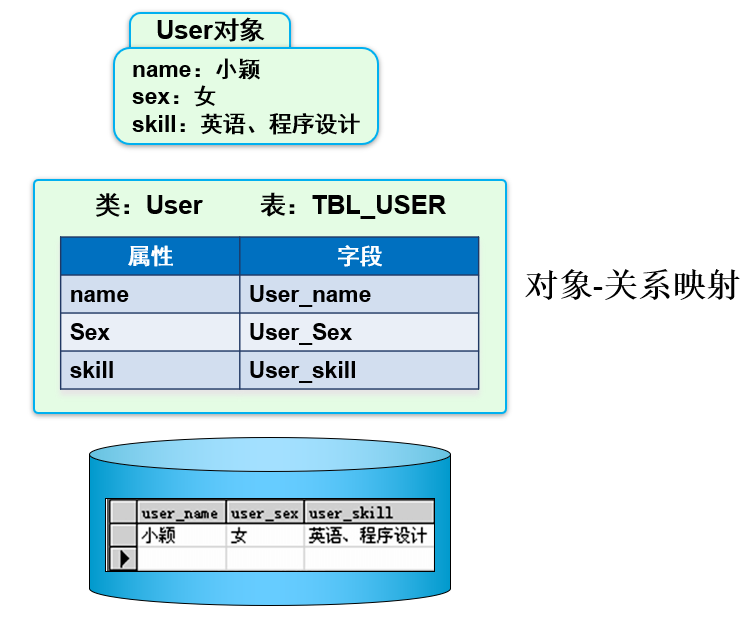
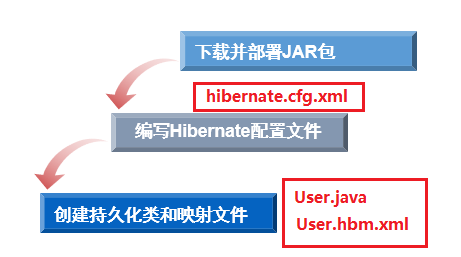
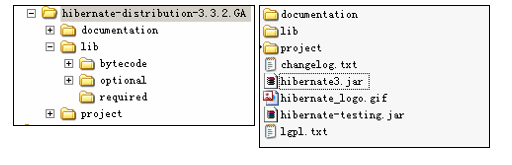

# hibernate_简介

### 一、hibernate简介

* 1、Hibernate的优势

  * 优秀的Java 持久化层解决方案

  * 主流的对象—关系映射工具

  * 简化了JDBC 繁琐的编码

        Configuration configure = new Configuration().configure();
        SessionFactory sessionFactory = configure.buildSessionFactory();
        Session session = sessionFactory.openSession();
        Query query = session.createQuery("from User");
        List<User> users =(List<User>)query.list();

  * 将数据库的连接信息都存放在配置文件

* 2、持久化与`ORM2`-1

  * 持久化是程序数据在瞬时状态和持久状态间转换的过程

    

* 3、持久化与`ORM2`-2

  * ORM（Object Relational Mapping）

    * 编写程序的时候，以面向对象的方式处理数据

    * 保存数据的时候，却以关系型数据库的方式存储

  * ORM解决方案包含下面四个部分

    * 在持久化对象上执行基本的增、删、改、查操作

    * 对持久化对象提供一种查询语言或者API

    * 对象关系映射工具

    * 提供与事务对象交互、执行检查、延迟加载以及其他优化功能	

    

* 4、准备Hibernate步骤

    

  * 下载并部署JAR包 [下载](./hibernate-lib)
  
  * 编写Hibernate配置文件(`hibernate.cfg.xml`)

        <?xml version="1.0" encoding="UTF-8"?>
        <!DOCTYPE hibernate-configuration PUBLIC
            "-//Hibernate/Hibernate Configuration DTD 3.0//EN"
            "http://hibernate.sourceforge.net/hibernate-configuration-3.0.dtd">
        <hibernate-configuration>
            <session-factory name="sessionFactory">
                <property name="hibernate.connection.driver_class">com.mysql.jdbc.Driver</property>
                <property name="hibernate.connection.password">root</property>
                <property name="hibernate.connection.url">jdbc:mysql://localhost:3306/mybatis</property>
                <property name="hibernate.connection.username">root</property>
                <property name="hibernate.dialect">org.hibernate.dialect.MySQL5Dialect</property>

                <property name="show_sql">true</property><!--显示sql语句-->
                <property name="format_sql">true</property><!--sql语句太长时格式化显示-->

                <!--省略其他配置-->
                <!--注意配置文件名必须包含其相对于classpath 的全路径-->
                <mapping resource="com/edu/bean/User.hbm.xml"/>

            </session-factory>
        </hibernate-configuration>

  
  * 创建持久化类和映射文件(`User.java`和`User.hbm.xml`)

### 二、准备Hibernate

* 1、下载需要的jar包
    
    * Hibernate 的官方主页是  www.hibernate.org
    
    * 推荐下载hibernate-distribution-3.3.2.GA-dist.zip
    
    * Hibernate包目录结构
    
        

* 2、部署jar包

* 3、创建Hibernate配置文件

    * 用于配置数据库连接

    * 运行时所需的各种属性

    * 默认文件名为“hibernate.cfg.xml”

* 4、创建持久化类和映射文件

    * 定义持久化类（也称实体类），实现`java.io.Serializable` 接口，添加默认构造方法

          public class Dept implements Serializable {
              private Byte deptNo;
              private String deptName;
              private String location;
              public Dept() {
              }
              //省略getter&setter 方法
          }

    * 配置映射文件（`*.hbm.xml`）

          <hibernate-mapping>
              <class name="cn.wx.hibernatedemo.entity.Dept" table="dept">
                  <id name="deptNo" column="deptno" type="java.lang.Byte">
                      <generator class="assigned"/>
                  </id>
                  <property name="deptName" type="java.lang.String" column="dname"/>
                  <property name="location" type="java.lang.String">
                      <column name="loc"></column>
                  </property>
              </class>
          </hibernate-mapping>

    * 向`hibernate.cfg.xml`文件中配置映射文件

          <session-factory>
              <!--省略其他配置-->
              <!--注意配置文件名必须包含其相对于classpath 的全路径-->
              <mapping resource=“cn/wx/hibernatedemo/entity/Dept.hbm.xml" />
          </session-factory>

