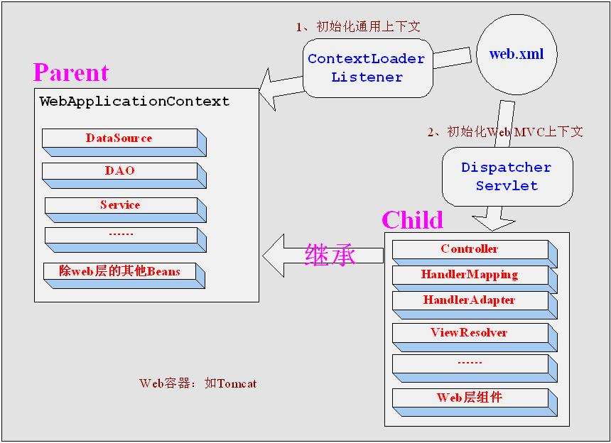

# ssm整合之启动流程

### 一、三大容器：

* 容器:管理对象的组件，如web容器管理`servlet`，`filter`，`listener`，也叫servlet容器

* 在SSM项目的框架整合，说白了首先3个容器得整合，**`web容器`，`spring容器`，`springmvc容器`**，再由spring容器去做其他整合扩展

* spring容器我们之前需要靠new ClassPathXmlApplicationContext("applicationContext.xml")来启动

* springmvc容器(用于管理控制器，拦截器等对象)的启动由DispatcherServlet完成，也就是说**springmvc容器天生和web容器整合，随web容器的启动而启动。**

* 那么我们spring容器也由web容器启动不是挺好？

      <?xml version="1.0" encoding="UTF-8"?>
      <web-app version="3.0" xmlns="http://java.sun.com/xml/ns/javaee" 
               xmlns:xsi="http://www.w3.org/2001/XMLSchema-instance"
               xsi:schemaLocation="http://java.sun.com/xml/ns/javaee 
                                   http://java.sun.com/xml/ns/javaee/web-app_3_0.xsd">

          <!-- Spring监听器,  启动spring容器 -->
          <listener>
              <description>Spring监听器</description>
              <listener-class>org.springframework.web.context.ContextLoaderListener</listener-class>
          </listener>

          <!-- Spring MVC ，启动springmvc容器-->
          <servlet>
              <servlet-name>SpringMVC</servlet-name>
              <servlet-class>org.springframework.web.servlet.DispatcherServlet</servlet-class>
              <init-param>
                  <description>SpringMVC</description>
                  <param-name>contextConfigLocation</param-name>
                  <param-value>classpath:spring/spring-mvc.xml</param-value>
              </init-param>
              <load-on-startup>1</load-on-startup>
          </servlet>
          <servlet-mapping>
              <servlet-name>SpringMVC</servlet-name>
              <url-pattern>/</url-pattern>
          </servlet-mapping>
      </web-app>

### 二、整合模型：

   

* `web.xml 文件`中的先后顺序无关。web容器维护对象的顺序是：`context-param` -> `listener(spring)` -> `filter` -> `servlet(springmvc)`

* 导致容器的启动顺序为> web容器 > spring 容器 > springmvc容器 (父子容器)

* 子容器可以使用父容器的对象，反之不行

* 各容器应各司其职，否则引起混乱：
  
  * web容器： 管理servlet，listener，filter
  
  * spring容器： 管理除了controller的普通bean，事务 (spring扫描配置不要扫到controllerbean,controller可能失效)
  
  * springmvc容器： 管理controller，拦截器 (springmvc扫描配置不要扫到非controllerbean，事务可能失效)

